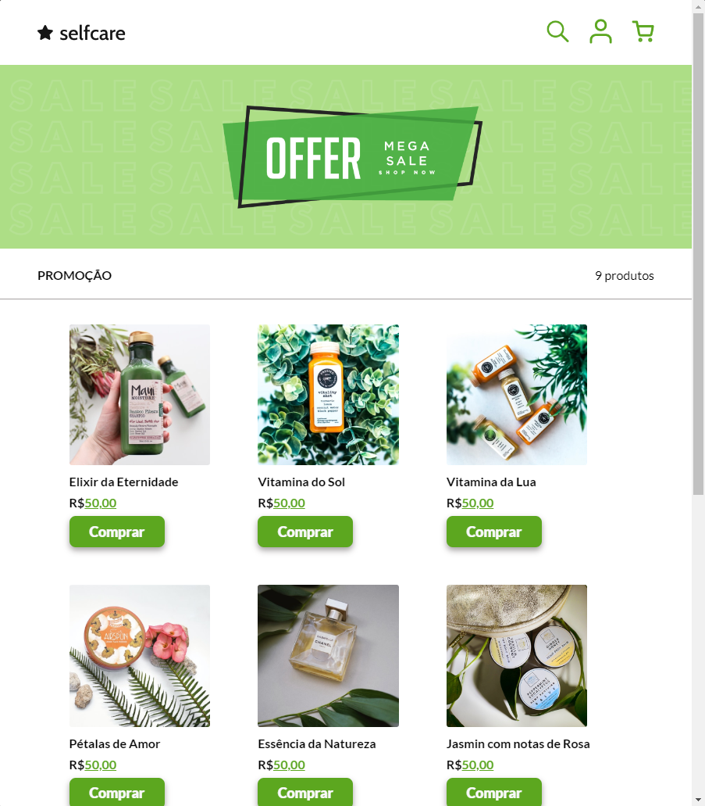

# Selfcare - Loja Online de Produtos de Bem-Estar

Bem-vindo ao repositório do projeto Selfcare, uma loja online de produtos de bem-estar! Este projeto foi desenvolvido com HTML, CSS (Sass) e JavaScript para oferecer uma experiência elegante e responsiva aos usuários.

## Tecnologias utilizadas

* HTML
* CSS
* Saas
* JavaScript
* Fonts Google
* Font Awesome

## Como utilizar
1. Faça o clone deste repositório em sua máquina local.
2. Abra o arquivo `index.html` em seu navegador para visualizar a página.

## Recursos Principais

#### Barra de Navegação

* Logo Selfcare
* Ícones para pesquisa, perfil e carrinho

#### Seção Principal

* Banner promocional
* Informações sobre promoções

#### Produtos em Destaque

* Cartões para produtos individuais
* Botão "Comprar" com funcionalidade de abrir o carrinho

#### Modal 

* Carrinho acessível via botão "Comprar"
* Fechamento do carrinho via botão "X" ou clique fora do modal

#### Rodapé

* Links de contato e políticas
* Formulário de inscrição para newsletter
* Ícones de redes sociais e bandeiras de pagamento

## Links

*  [Link do Projeto](https://ecommerce-selfcare.vercel.app//).
*  [Link do GitHub](https://github.com/manoelarcanjo/ecommerce-offer).

## O Projeto

